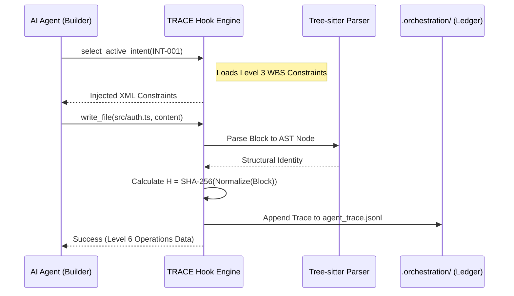

# ARCHITECTURE REPORT: The Governed AI-Native IDE

**Role:** Forward Deployed Engineer (FDE)  
**Framework:** TRACE (Trusted Runtime for Autonomous Containment and Evidence)

---

## Executive Summary

This report formalizes the architecture for a governed AI-Native IDE, engineered to bridge the Provenance Gap between probabilistic reasoning and deterministic software engineering (Entire, 2026). By embedding infrastructure-level mediation into the IDE tool loop, we replace "vibe coding" with cryptographic verification and structured intent (TRACE, 2026; Bora, 2024).

---

## 1. How the VS Code Extension Works: Dual-Process Topology

To ensure security and performance, the extension operates as a distributed system within VS Code (VS Code, 2026):

### Extension Host (Logic Layer)

A Node.js process where the core orchestrator (`src/core/Cline.ts`) manages the agentic loop. It has full privileges for filesystem access and terminal execution (VS Code, 2026).

### Webview (UI Layer)

A restricted React sandbox for the user interface. It communicates with the Host via the `postMessage` API, ensuring reasoning-heavy tasks do not block the UI thread (Ansible, 2026).

> My architecture intercepts the Thinking-Acting-Observing loop at the Extension Host level, mediating every system-level tool call (e.g., `write_to_file`) before execution (Roo Code, 2026).

---

## 2. Code & Design Architecture: The Shared Brain

Based on my Phase 0 archaeological dig into the Roo Code "nervous system," I have implemented two critical intervention points (Bockeler, 2025):

- **The Prompt Factory (`src/core/prompts/system.ts`)**  
  Modified the prompt builder to move from "Instruction-based" to "Context-based" engineering. The agent is now architecturally barred from code synthesis until it completes a mandatory "Reasoning Handshake" (Bora, 2024; Bockeler, 2025).

- **The Shared Brain (`AGENT.md`)**  
  Acts as a persistent project "Constitution." It records lessons learned from failed verification loops, preventing Context Rot during parallel agent sessions (LF Projects, 2025).

---

## 3. Architectural Decisions: The TRACE Hook Engine

I have implemented the TRACE framework to derive assurance from infrastructure mediation rather than model behavior (TRACE, 2026).

- **Command Classification:** Every tool is classified as Safe (Read/Search) or Destructive (Write/Execute) (Roo Code, 2026).
- **The Handshake (Pre-Hook):** Mutation is prohibited until the agent calls `select_active_intent(intent_id)`. This pauses the promise chain and injects `What-Boundaries-Success` (WBS) constraints from `.orchestration/active_intents.yaml` into the current context (Bora, 2024).
- **Autonomous Recovery:** If the engine blocks an action, it returns a standardized JSON error to the LLM, allowing the "silicon worker" to self-correct without human intervention (TRACE, 2026).

---

## 4. Diagrams & Schemas

### Advanced Intent-Code Traceability Flow

I integrated Nancy Leveson’s Seven Levels of Intent Specification to provide a vertical trace from Level 1 (System Purpose) to Level 5 (Physical Code) (Navarro et al., 2001).

### Code Snippet (Sequence Diagram)

